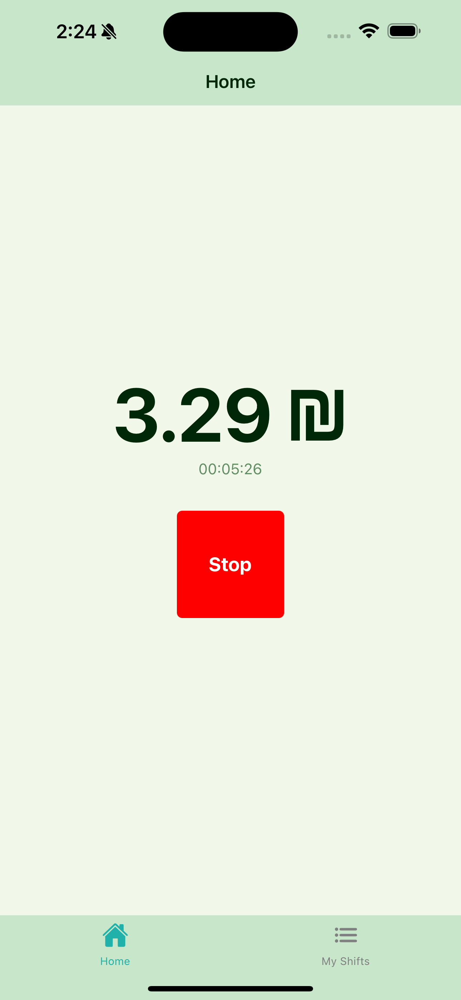
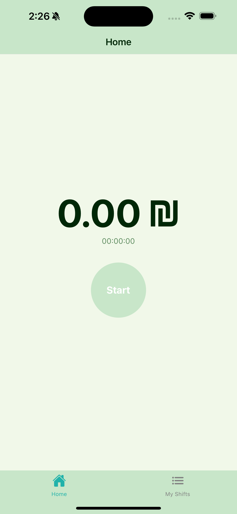
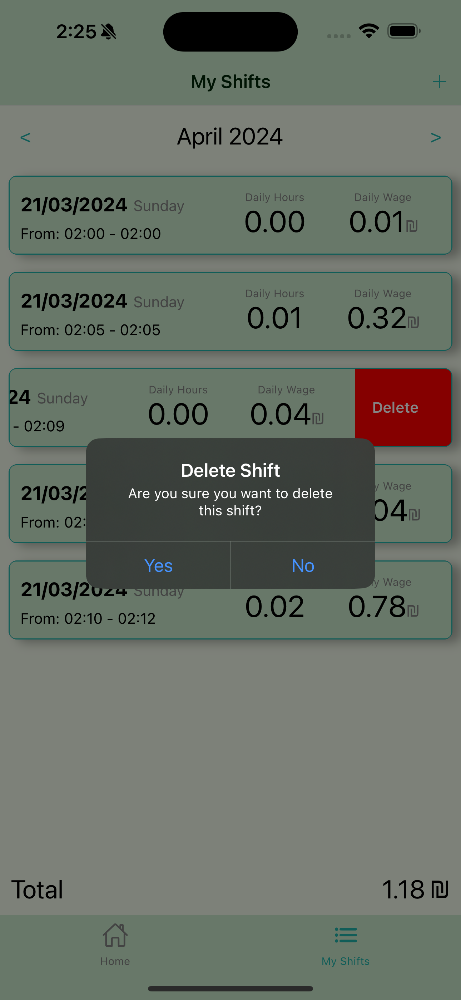
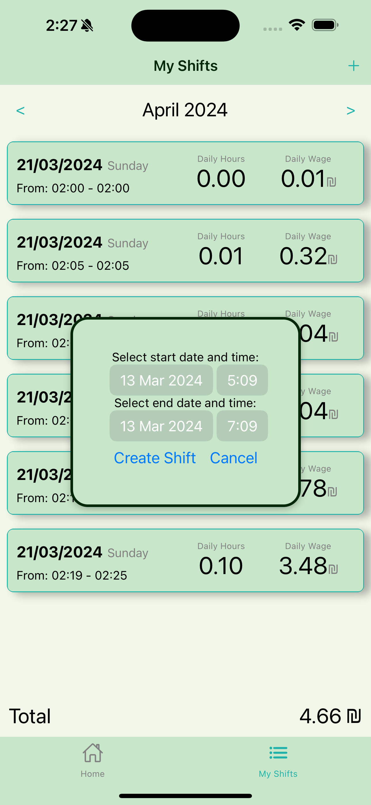

# 🔄 Changes

- Adding Green Theme
- Browsing through different months functionallity
- Creating manually past or future shift
- Deleting shift document functionality
- More user friendly Start/Stop button.
- Overall better UI

# 📷 This will give a visual updates of the app

